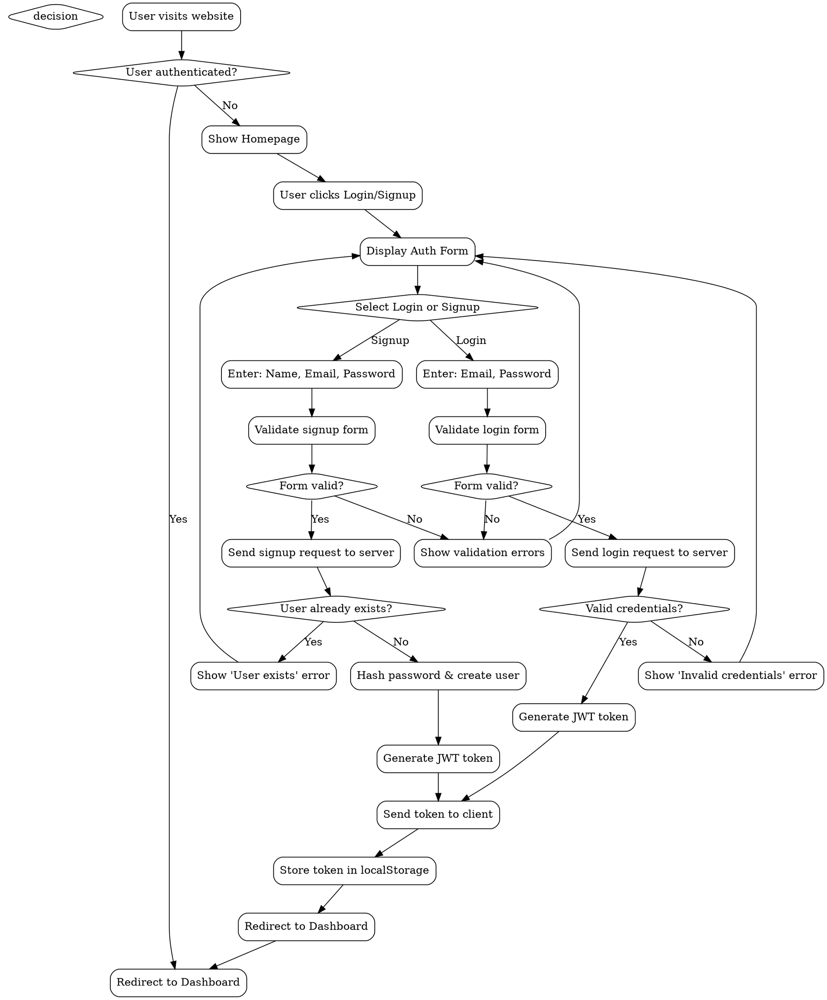
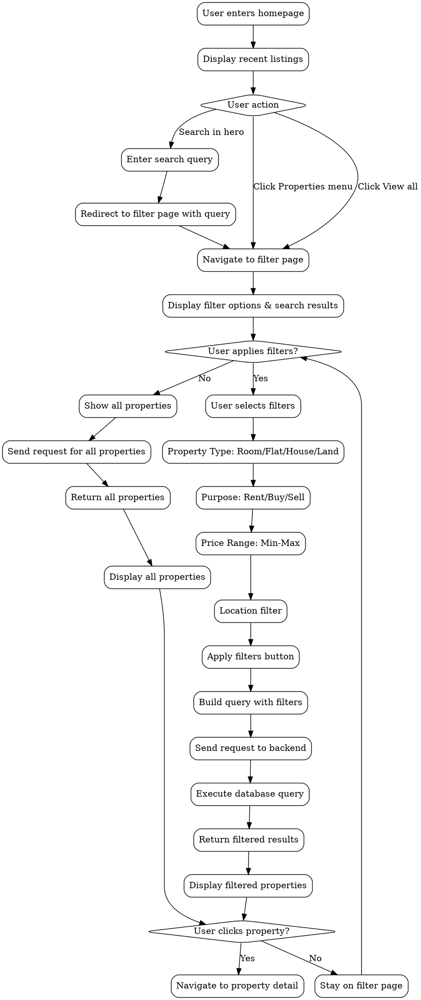
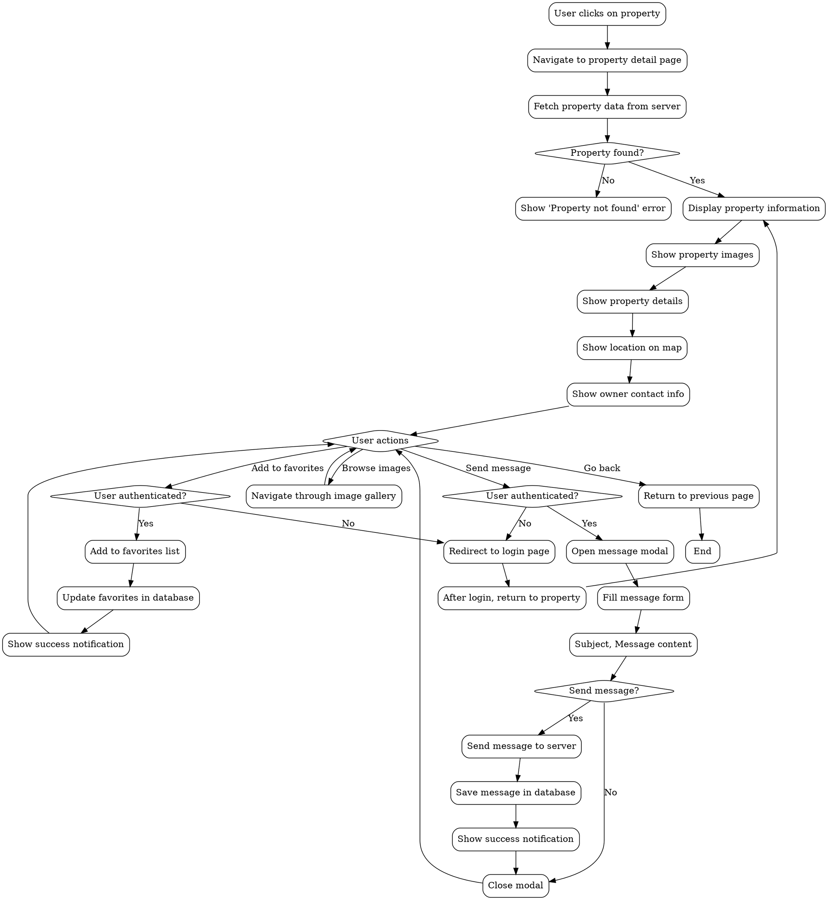
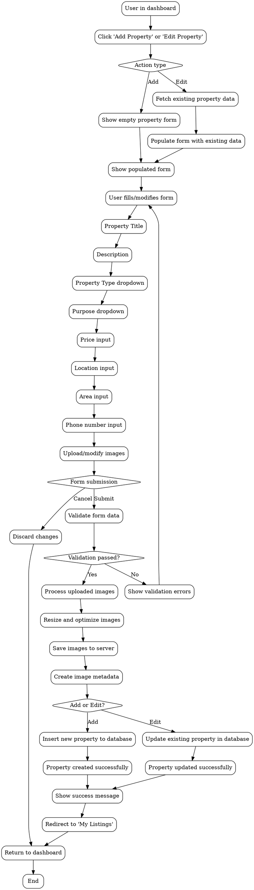
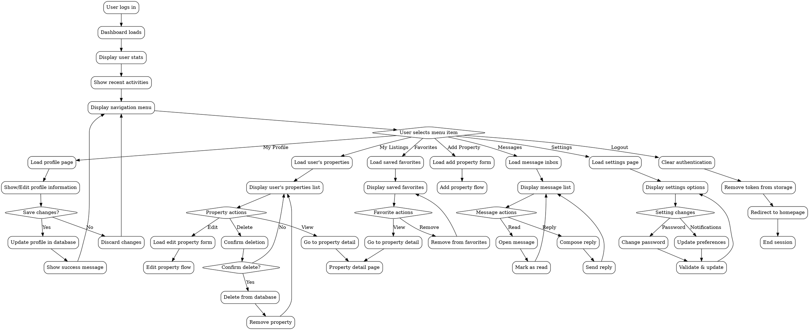
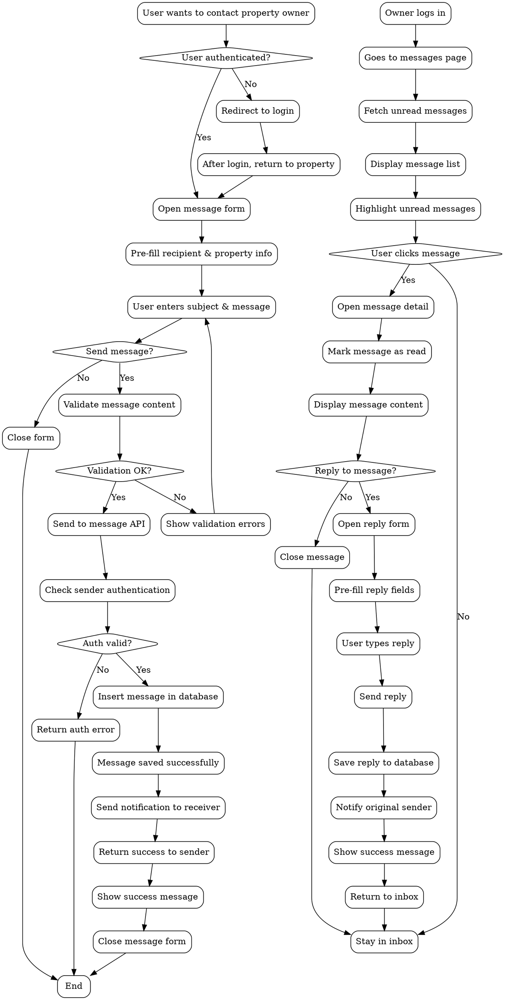
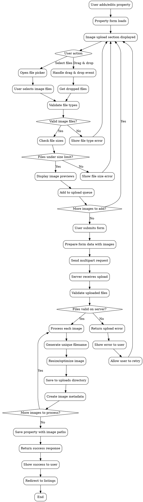
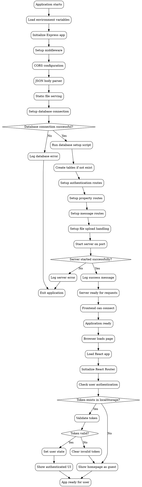

# GharBazaar System Flowcharts (Graphviz DOT Format)

## 1. User Registration & Authentication Flowchart



## 2. Property Search & Filter Flowchart



## 3. Property Detail & Messaging Flowchart



## 4. Property Management (Add/Edit) Flowchart



## 5. User Dashboard Navigation Flowchart



## 6. Message System Flowchart



## 7. File Upload Flowchart



## 8. Application Startup Flowchart



## Usage Instructions

To use these Graphviz DOT files:

1. **Install Graphviz**: Download from https://graphviz.org/download/
2. **Command line usage**:

   ```bash
   # Generate PNG
   dot -Tpng flowchart.dot -o flowchart.png

   # Generate SVG
   dot -Tsvg flowchart.dot -o flowchart.svg

   # Generate PDF
   dot -Tpdf flowchart.dot -o flowchart.pdf
   ```

3. **Online tools**: You can also use online Graphviz renderers like:

   - https://dreampuf.github.io/GraphvizOnline/
   - https://magjac.com/graphviz-visual-editor/

4. **VS Code extension**: Install "Graphviz (dot) language support" extension for syntax highlighting and preview.

## Customization Options

You can customize the appearance by modifying these attributes:

- `node [shape=box, style=rounded, color=blue, fillcolor=lightblue, style="filled,rounded"]`
- `edge [color=red, style=dashed]`
- `rankdir=LR` for left-to-right layout instead of top-to-bottom
- `bgcolor=white` for background color
