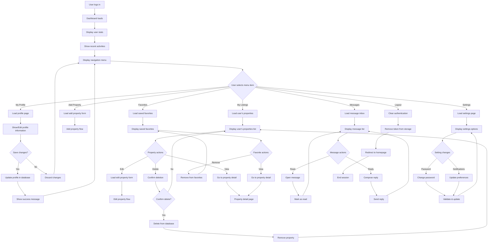
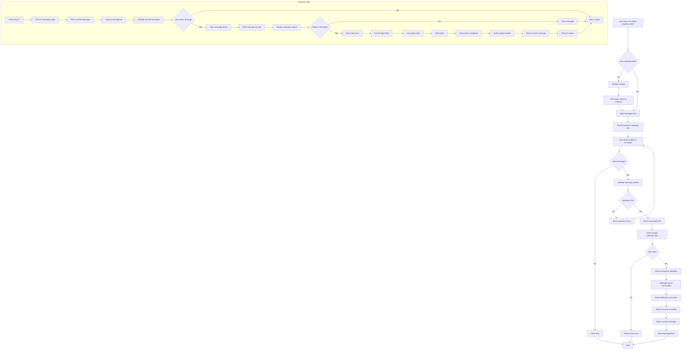
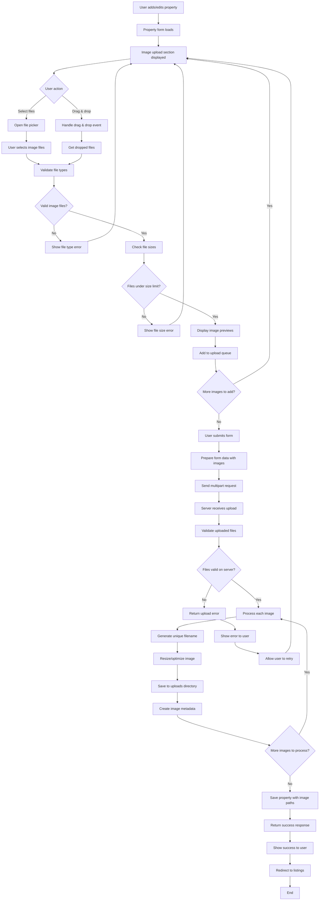
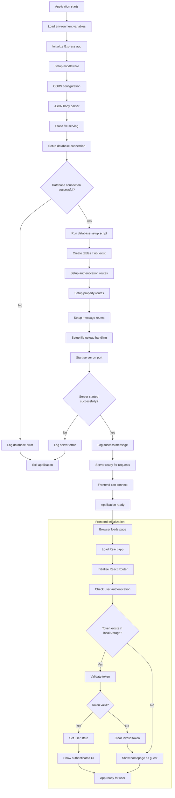

# GharBazaar System Flowcharts

## 1. User Registration & Authentication Flowchart

```mermaid
flowchart TD
    A[User visits website] --> B{User authenticated?}
    B -->|Yes| C[Redirect to Dashboard]
    B -->|No| D[Show Homepage]

    D --> E[User clicks Login/Signup]
    E --> F[Display Auth Form]
    F --> G{Select Login or Signup}

    G -->|Signup| H[Enter: Name, Email, Password]
    G -->|Login| I[Enter: Email, Password]

    H --> J[Validate signup form]
    I --> K[Validate login form]

    J --> L{Form valid?}
    K --> M{Form valid?}

    L -->|No| N[Show validation errors]
    M -->|No| N
    N --> F

    L -->|Yes| O[Send signup request to server]
    M -->|Yes| P[Send login request to server]

    O --> Q{User already exists?}
    Q -->|Yes| R[Show "User exists" error]
    R --> F
    Q -->|No| S[Hash password & create user]

    P --> T{Valid credentials?}
    T -->|No| U[Show "Invalid credentials" error]
    U --> F
    T -->|Yes| V[Generate JWT token]

    S --> W[Generate JWT token]
    V --> X[Send token to client]
    W --> X

    X --> Y[Store token in localStorage]
    Y --> Z[Redirect to Dashboard]
    Z --> C
```

## 2. Property Search & Filter Flowchart

```mermaid
flowchart TD
    A[User enters homepage] --> B[Display recent listings]
    B --> C{User action}

    C -->|Search in hero| D[Enter search query]
    C -->|Click Properties menu| E[Navigate to filter page]
    C -->|Click "View all"| E

    D --> F[Redirect to filter page with query]
    F --> E

    E --> G[Display filter options & search results]
    G --> H{User applies filters?}

    H -->|No| I[Show all properties]
    H -->|Yes| J[User selects filters]

    J --> K[Property Type: Room/Flat/House/Land]
    K --> L[Purpose: Rent/Buy/Sell]
    L --> M[Price Range: Min-Max]
    M --> N[Location filter]
    N --> O[Apply filters button]

    O --> P[Build query with filters]
    P --> Q[Send request to backend]
    Q --> R[Execute database query]
    R --> S[Return filtered results]
    S --> T[Display filtered properties]

    I --> U[Send request for all properties]
    U --> V[Return all properties]
    V --> W[Display all properties]

    T --> X{User clicks property?}
    W --> X
    X -->|Yes| Y[Navigate to property detail]
    X -->|No| Z[Stay on filter page]
    Z --> H
```

## 3. Property Detail & Messaging Flowchart

```mermaid
flowchart TD
    A[User clicks on property] --> B[Navigate to property detail page]
    B --> C[Fetch property data from server]
    C --> D{Property found?}

    D -->|No| E[Show "Property not found" error]
    D -->|Yes| F[Display property information]

    F --> G[Show property images]
    G --> H[Show property details]
    H --> I[Show location on map]
    I --> J[Show owner contact info]

    J --> K{User actions}
    K -->|Browse images| L[Navigate through image gallery]
    K -->|Send message| M{User authenticated?}
    K -->|Add to favorites| N{User authenticated?}
    K -->|Go back| O[Return to previous page]

    L --> K
    O --> P[End]

    M -->|No| Q[Redirect to login page]
    N -->|No| Q
    Q --> R[After login, return to property]
    R --> F

    M -->|Yes| S[Open message modal]
    S --> T[Fill message form]
    T --> U[Subject, Message content]
    U --> V{Send message?}
    V -->|No| W[Close modal]
    V -->|Yes| X[Send message to server]

    X --> Y[Save message in database]
    Y --> Z[Show success notification]
    Z --> W
    W --> K

    N -->|Yes| AA[Add to favorites list]
    AA --> BB[Update favorites in database]
    BB --> CC[Show success notification]
    CC --> K
```

## 4. Property Management (Add/Edit) Flowchart

```mermaid
flowchart TD
    A[User in dashboard] --> B[Click "Add Property" or "Edit Property"]
    B --> C{Action type}

    C -->|Add| D[Show empty property form]
    C -->|Edit| E[Fetch existing property data]
    E --> F[Populate form with existing data]
    F --> G[Show populated form]
    D --> G

    G --> H[User fills/modifies form]
    H --> I[Property Title]
    I --> J[Description]
    J --> K[Property Type dropdown]
    K --> L[Purpose dropdown]
    L --> M[Price input]
    M --> N[Location input]
    N --> O[Area input]
    O --> P[Phone number input]
    P --> Q[Upload/modify images]

    Q --> R{Form submission}
    R -->|Cancel| S[Discard changes]
    R -->|Submit| T[Validate form data]

    T --> U{Validation passed?}
    U -->|No| V[Show validation errors]
    V --> H

    U -->|Yes| W[Process uploaded images]
    W --> X[Resize and optimize images]
    X --> Y[Save images to server]
    Y --> Z[Create image metadata]

    Z --> AA{Add or Edit?}
    AA -->|Add| BB[Insert new property to database]
    AA -->|Edit| CC[Update existing property in database]

    BB --> DD[Property created successfully]
    CC --> EE[Property updated successfully]

    DD --> FF[Show success message]
    EE --> FF
    FF --> GG[Redirect to "My Listings"]

    S --> HH[Return to dashboard]
    GG --> HH
    HH --> II[End]
```

## 5. User Dashboard Navigation Flowchart



## 6. Message System Flowchart



## 7. File Upload Flowchart



## 8. Application Startup Flowchart


