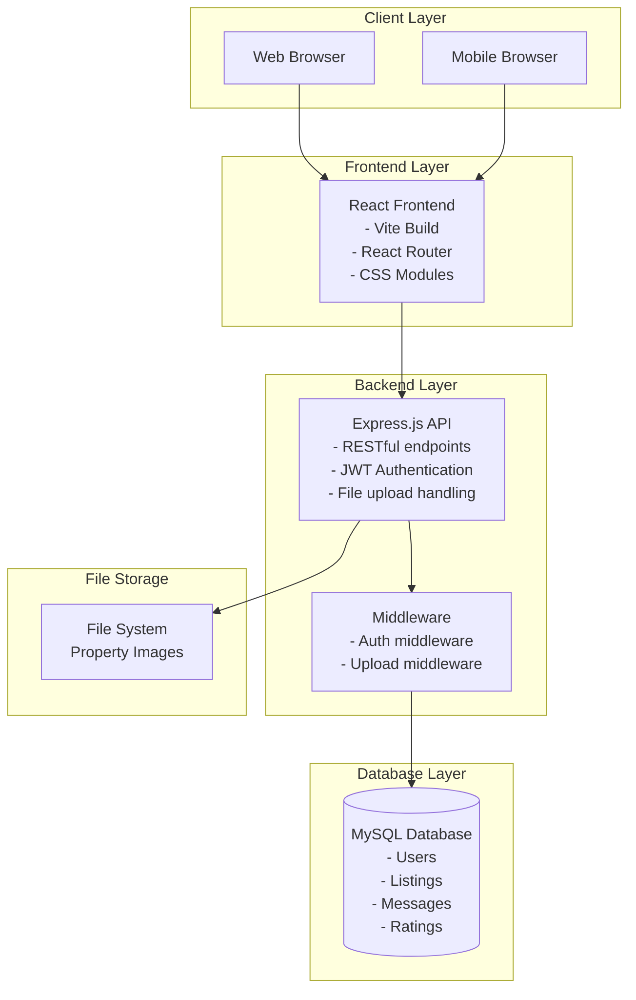
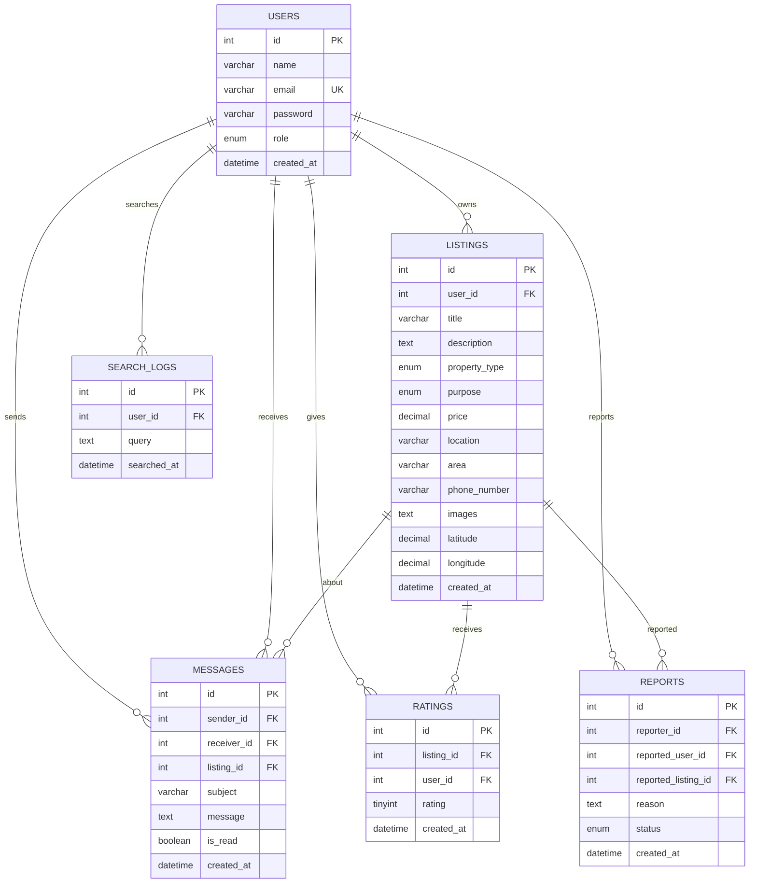
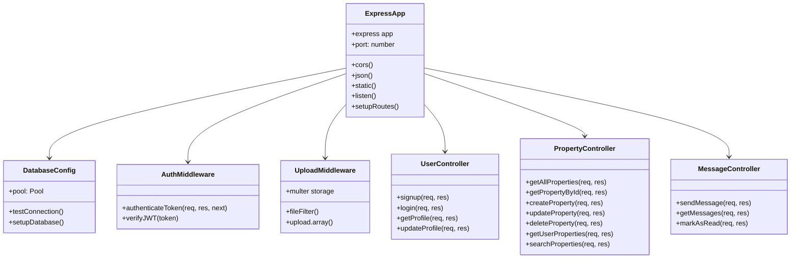
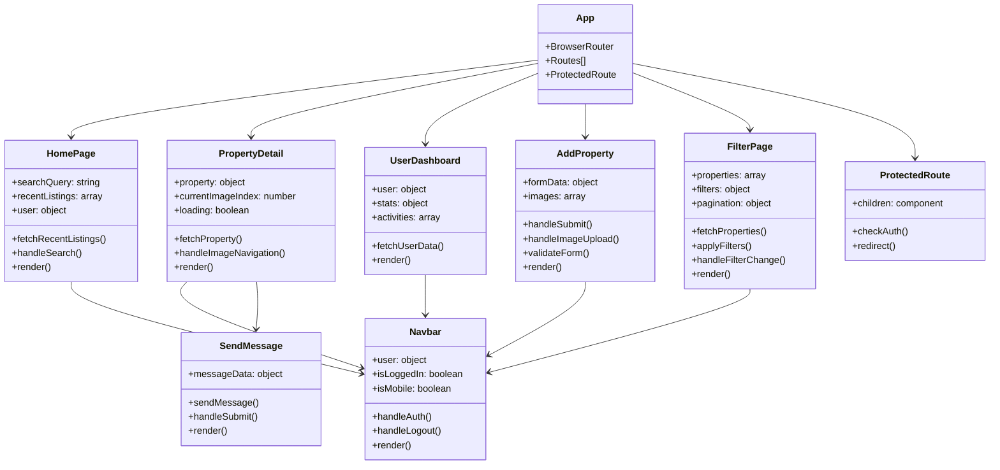
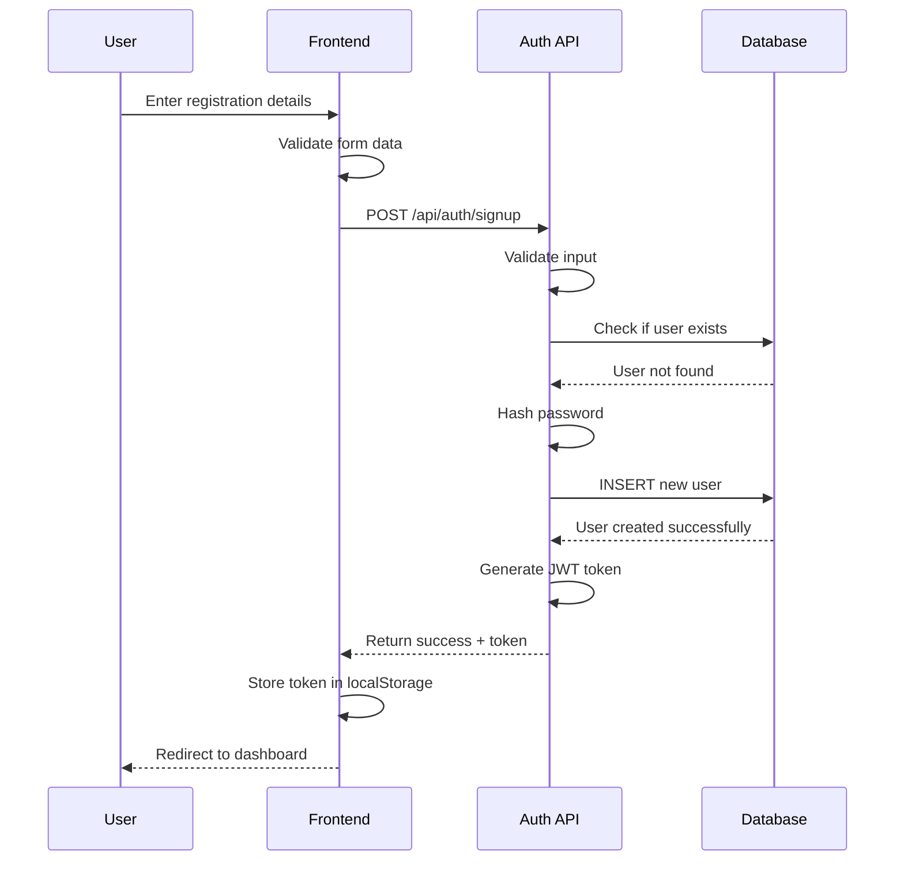
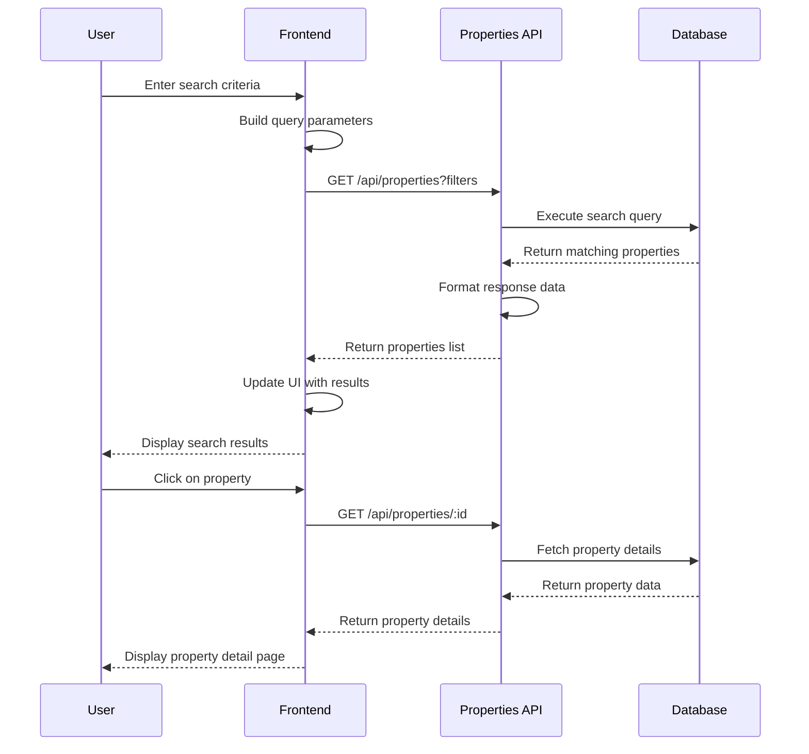
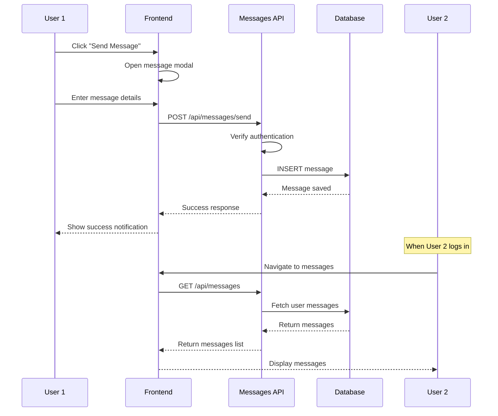
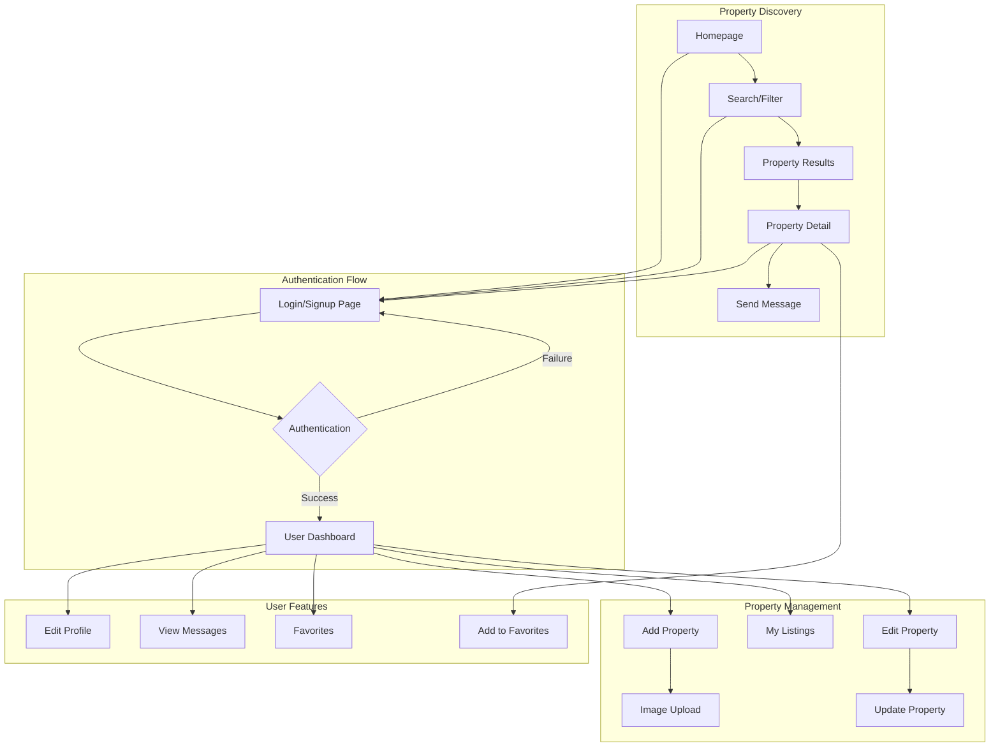
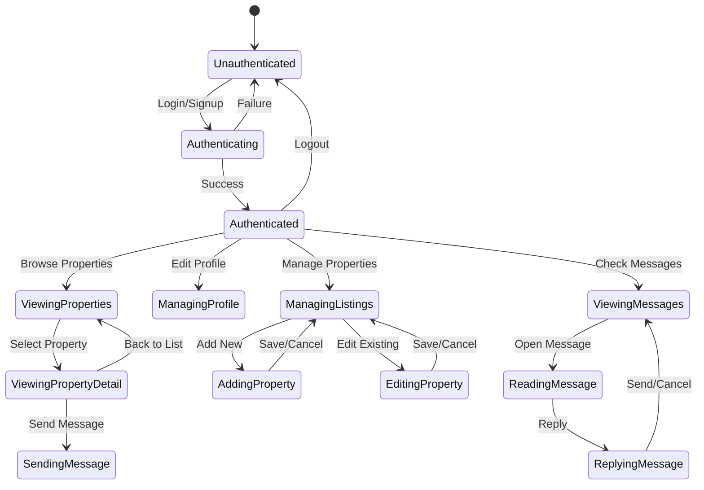

# GharBazaar UML Diagrams

## 1. System Architecture Diagram

## 2. Database Entity Relationship Diagram

## 3. Class Diagram - Backend Components

## 4. Class Diagram - Frontend Components

## 5. Sequence Diagram - User Registration Flow

## 6. Sequence Diagram - Property Search Flow

## 7. Sequence Diagram - Message System Flow

## 8. Component Interaction Diagram

## 9. State Management Diagram

